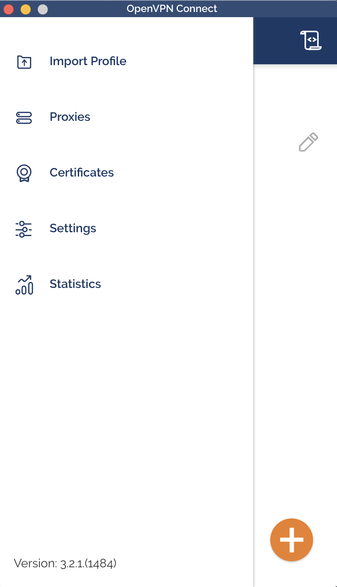
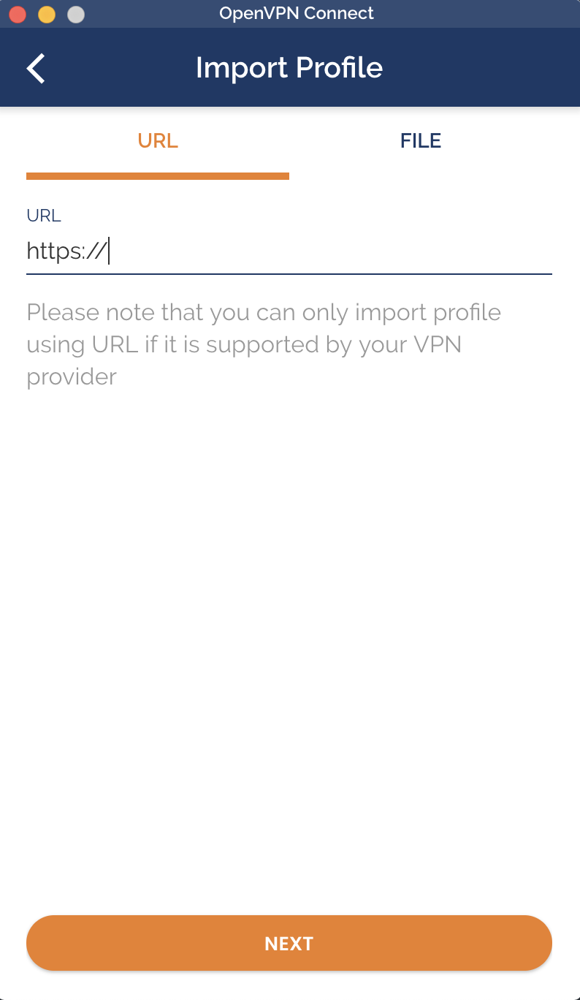
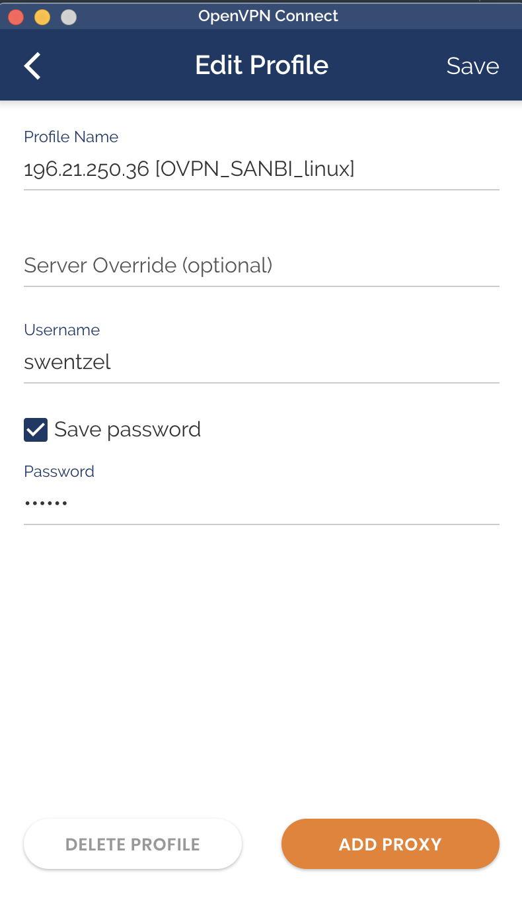
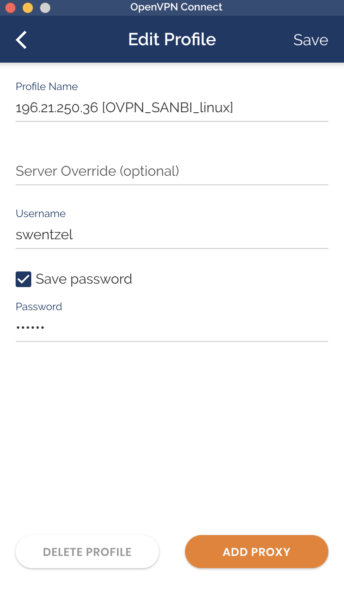

# Using the SANBI VPN

A user might want to access some UWC internal network devices or services while being outside of the university. In this case, the user must use a VPN connection in order for the user's machine to act is if they are on the UWC network.

=

## MacOS

#### Installing the app

**Download the Open App   [HERE](https://raw.githubusercontent.com/SANBI-SA/user_documentation/master/docs/_files/openvpn-connect-3.3.6.4368_signed.dmg)**.

**Download the OpenVPN profile file  [HERE](https://raw.githubusercontent.com/SANBI-SA/user_documentation/master/docs/_files/OVPN_SANBI_macos.ovpn)**.

Install the app and open it, its a good idea to add it to your doc

Next import the profile by using the file downloaded, chose file instead of url and use the opvn file







Now fill in your VPN and password, check the save password cehckbox




Click the radio button to connect


## Ubuntu Linux

### 16.04

#### Installing the packages

Some software packages are required to get OpenVPN to work on Ubuntu 16.

Open a terminal (Ctrl + Alt + T) and enter:

```shell
sudo apt install network-manager-openvpn-gnome
```

Once the install is complete, you'll have new network options made available to you in the system settings.

#### Configure the VPN

**Download the OpenVPN profile file  [HERE](https://raw.githubusercontent.com/SANBI-SA/user_documentation/master/docs/_files/OVPN_SANBI_linux.ovpn)**.

Open the `System Settings` dialog and select the `Network` icon. You will see the following screen:


Click the plus icon in the lower left of the window, make sure that `VPN` is selected in the `Interface` dropdown and click `Create...` .


In the dropdown (shown below), select `Import a saved VPN configuration...`, click `Create...`, select the downloaded `OVPN_SANBI_linux.ovpn` file and click `Open`.


A new window will pop up where you must type your authentication credentials (**without @sanbi.ac.za**) under the `User name:` and `Password:` fields. Click `Save` when done.


**_OPTIONAL:_ You can allow this VPN to only provide the IP addresses from within SANBI and not route all of your traffic through SANBI. To do this, go to the `IPv4 Settings` tab in the window above followed by `Routes...`, tick on `Use this connection only for resources on its network` and click `OK` followed by `Save`.**

You can now connect to the SANBI VPN from the network dropdown.


### 17.10+

Since Ubuntu 17.10 onwards introduced the Gnome desktop manager instead of the old Unity desktop manager, the way to add and connect to VPNs has changed slightly.

#### Installing the packages

You'll need to ensure that the appropriate apt repositories are enabled before you can install all the OpenVPN packages:

```shell

sudo add-apt-repository universe
sudo add-apt-repository multiverse
sudo apt update
```

Open a terminal (Ctrl + Alt + T), enter:

```shell
sudo apt install openvpn network-manager-openvpn network-manager-openvpn-gnome
```
and hit enter. This will install the client packages for OpenVPN on your machine.

Once the installation is complete, run the following command to restart the networking service:

```shell
sudo service network-manager restart
```

#### Configure the VPN

**Download the OpenVPN profile file [HERE](https://raw.githubusercontent.com/SANBI-SA/user_documentation/master/docs/_files/OVPN_SANBI_linux.ovpn)**.

 Open the system `Settings` dialog and select the `Network` tab on the left. You'll see the `VPN` heading.


Click the `+` icon to the right of the heading and select the `Import from file...` option.


Select the `OVPN_SANBI_linux.ovpn` file in the dialog box that opens and click `Open`.

A new window will pop up where you must type your authentication credentials (**without @sanbi.ac.za**) under the `User name` and `Password` fields. Click `Add` when done.


**_OPTIONAL:_ You can allow this VPN to only provide the IP addresses from within SANBI and not route all of your traffic through SANBI. To do this, go to the `IPv4` tab in the window above, tick on `Use this connection only for resources on its network` and click `Add`.**

You will now see your VPN connection listed under the `VPN` heading. You'll now be able to connect to the SANBI VPN.


## Mac OS

### Catalina

**Download the OpenVPN profile file [HERE](https://raw.githubusercontent.com/SANBI-SA/user_documentation/master/docs/_files/OVPN_SANBI_macos.ovpn)**.

 Open the system `Menu` and import a new profile


 Choose to import from file


 Select the `OVPN_SANBI_macos.ovpn` file.

 Next you need to input your username and password, click save.


 Once saved, it should show up on your list of vpns.



 To connect, just move the slider


