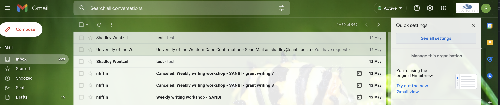
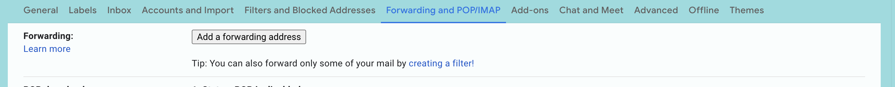
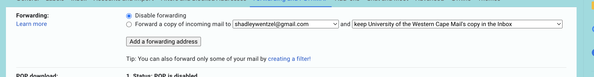

# Forward SANBI mail to UWC Mail Account

Our Google Workspace will be migrated over to a UWC managed Workspace, this means that we need to forward all mail received on our
SANBI Google Mail Addressses to our UWC Google Mail Addresses.

1. Your UWC Gmail identity: username and password. This is the same username and password that you use to access email.

## Setting up email forwarding

### Step 1 ###
Log into your SANBI Gmail account

### Step 2 ###
Click the Gear icon, this will open your gmail settings, select **all settings**

### Step 3 ###
On the settings screen, select the **Forwarding and POP/IMAP** tab 

### Step 4 ###
From this sreen, click the **Add a forwarding address** button 

### Step 5 ###
A dialog window should pop up and allow you to capture the forwarding email address, this would be your new uwc gmail address (example@uwc.ac.za)

### Step 6 ###
A confirmation dialog will pop-up to confirm the address. Click proceed.

### Step 7 ###
A confirmation email will be sent to the email address you suypplied in step 5

### Step 8 ###
If you check the mail box, (example@uwc.ac.za). There should be a verification link, click this link. It would look something like "https://mail-settings.google.com/mail/vf-%5BANGjdJ-aMU4p19_Yf7vomQfNU2PoRH4055KBTUj0Uc2Qbrwmp6qWHkQkn5ra5v-INDNG3bL5W7Nkv6o6Qpor7xRUDPpoiMfAzJTkKYYnDg%5D-Lqp8lCviBG4IRRmmb6k7Yc9TLXg
"

### Step 9 ###
After clicking this link you will be taken to the last Gmail Confirmation page. Click proceed and this will setup the forwarding

### Step 10 ###
Go back to the Settings page from Step3, select the new forwarding email address from the forwarding email addresses, your forwarding address (example@uwc.ac.za) should be an option. Select the radio button that corresponds to this email address 
