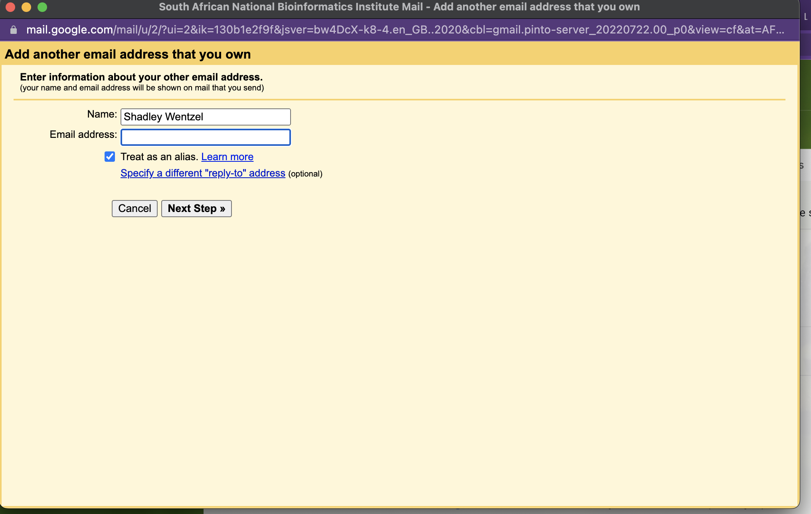
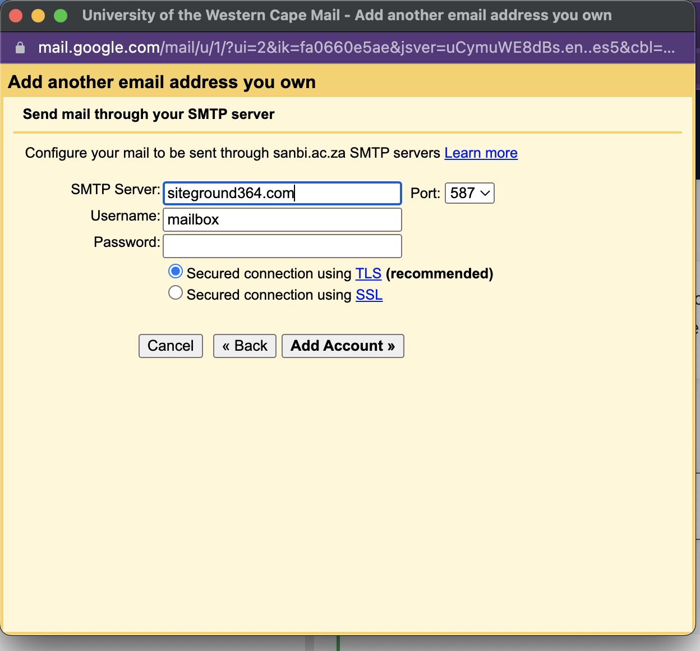

# Setup Mail Sending as SANBI mail from UWC Mail Account

Our Google Workspace will be migrated over to a UWC managed Workspace, this means that we need to setup the send as SANBI

1. Your UWC Gmail identity: username and password. This is the same username and password that you use to access email.

## Setting up email forwarding

### Step 1 ###
Log into your UWC Gmail account

### Step 2 ###
Click the Gear icon, this will open your gmail settings, select **all settings**

### Step 3 ###
On the settings screen, select the **Accounts and Import** tab 

### Step 4 ###
Under the **Send mail as:** section select the option to **Add another email address**

### Step 5 ###
This will bring up a dialog where you will need to enter your old SANBI email address: old@sanbi.ac.za, you can rename the account in the first text box if you want 

### Step 6 ###
Once you have captured your old SANBI Email address, the next screen will request the SMTP details so that it can forward mail as your SANBI account.
Each user will get a new SMTP password coupled to their old SANBI email address, you will need these details.
The details are:
    old@sanbi.ac.za
    password-for-smtp

### Step 7 ###
On the next screen you will need to enter the SMTP details, they are
    SMTP Server: siteground364.com
    SMTP Port: 465
    username: old@sanbi.ac.za
    password: password-for-smtp

Click add account to complete this step

### Step 8 ###
Now, a confirmation email will be sent to your old SANBI email account, retrieve the confirmation code.
Enter the code and click verify.
Go back to the settings page from step 4, your SANBI Gmail account should be an option under the **Send mail as:** section

